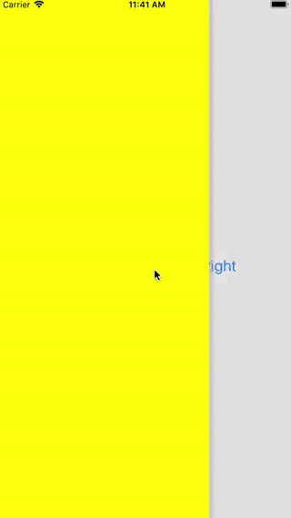

# GBKSlideMenu

“GBKSlideMenu” - easy and simple way for adding and managing a slide-menu in your app (developed using `Swift`)



## Features

- [x] Customizable direction a slide-menu can be opened from: top, bottom, left, right.
- [x] Customizable parameters: menu width, closing threshold on `Pan Gesture`, color and shadow opacity, current controller dimming color, close and open duration.
- [x] Adapt menu on screen orientation change (screen rotation)
- [x] Menu closing by `Pan Gesture` and clicking on the current controller.
- [x] Customizable slide-menu opening by `Pan Gesture`

## Requirements

- iOS 9.0+

## Installation

[CocoaPods](http://cocoapods.org) is a dependency manager for Cocoa projects. You can install it with the following command:

```bash
$ gem install cocoapods
```

To integrate `GBKSlideMenu` into your Xcode project using `CocoaPods`, specify it in your `Podfile`:

```ruby
platform :ios, '9.0'
use_frameworks!

target '<Your Target Name>' do
    pod ëGBKSlideMenuí, :git => 'git@github.com:gbksoft/GBKSlideMenu-ios'
end
```

Then, run the following command:

```bash
$ pod install
```

### Setup

Import framework into `UIViewController`, which will be displayed as Slide Menu:

```swift
import GBKSlideMenu
```

Install parent class `GBKSlideDismissController`:

```swift
class UIViewController: GBKSlideDismissController {
  ...
}
```


Customize desirable menu properties within  `viewDidLoad` method (otherwise default settings will be applied):

 - direction: GBKSlideMenuDirectionType - direction a slied-menu is opened from (default: left)

```swift
  public enum GBKSlideMenuDirectionType {
    case top
    case bottom
    case left
    case right
}
```

 - menuWidth: CGFloat - menu width (default: 0.6)
 - percentThreshold: percentThreshold - threshold for menu closing on `Pan Gesture` (default: 0.25)
 - dimmingColor: UIColor - dimming color of the current controller (default: UIColor.lightGray.withAlphaComponent(0.35))
 - shadow: (color: UIColor, opacity: Float) - color and shadow opacity (default: (.lightGray ,0.5))
 - duration: (present: TimeInterval, dismiss: TimeInterval) - open/close duration (default: (0.35, 0.35))

Display a controller:

```swift
  let vc = self.storyboard?.instantiateViewController(withIdentifier: myVCID) as! myVCName
  self.present(vc, animated: true, completion: nil)
```

Steps to open a slide-menu by means of `Pan Gesture`:
 - Import `GBKSlideMenu` framework into `UIViewController`, which will display a menu.
 - Install parent class `GBKSlidePresenterController`
 - Initialize `initGestureSlideController` property.

# Let us know
We'd be very happy if you sent links to your projects where you use our component. Just send us email to [github@gbksoft.com](mailto:github@gbksoft.com)